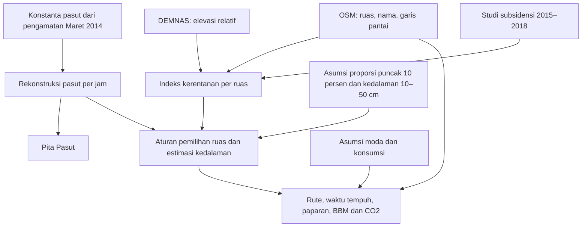
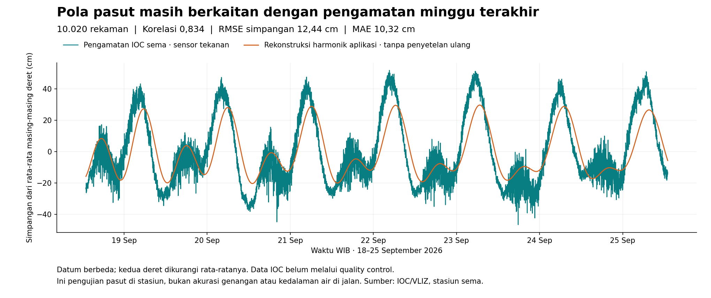

# Audit asal, kemutakhiran, dan validasi data — 25 September 2026

PASANG SURUT memakai sumber data nyata, hasil olahan, dan asumsi. Produksi
aktif memakai `kerentanan_v1`, bukan model pembelajaran mesin yang telah
tervalidasi untuk memprediksi genangan. Tanggal keluaran 2026 tidak berarti
semua masukan diukur pada 2026. Dengan keadaan sekarang, aplikasi layak
dijelaskan sebagai prototipe eksplorasi rute dan waktu berdasarkan skenario
kerentanan; kesiapan informasi operasional 2026–2029 belum terbukti.

Audit memeriksa kode main `d78792f`, metadata berkas, API publik, dua ruas
dalam transaksi database VPS hanya baca, jadwal khusus PASANG SURUT, sumber
primer daring, serta pengamatan IOC baru. Tidak ada model, database, layanan,
atau materi presentasi lama yang diubah. Tes perangkat lunak terdahulu tidak
menguji kebenaran kondisi genangan lapangan.

## 1. Hubungan data dengan dashboard

Hujan Open-Meteo dan eksperimen Sentinel-1 tersedia dalam pipeline penelitian,
tetapi tidak menjadi masukan prediksi genangan aktif `kerentanan_v1`.

## 2. Sumber, lokasi, umur data, dan berkas sebenarnya

| Data | Sumber dan lokasi | Waktu yang dapat dibuktikan | Berkas di repo/laptop dan penggunaannya |
|---|---|---|---|
| Jalan, nama, arah | [OpenStreetMap wilayah studi](https://www.openstreetmap.org/#map=13/-6.96/110.44), diambil melalui OSMnx/Overpass | Metadata GraphML: dibuat 24 Agustus 2026 01:19:54; zona waktu metadata tidak tertulis | [ruas_jalan.geojson](../../data/processed/ruas_jalan.geojson); `data/processed/graph.graphml` lokal. 19.394 sisi graf berarah, bukan 19.394 nama jalan berbeda. |
| Pantai dan kecamatan | Geometri OSM, pesisir Semarang | Timestamp pengambilan tidak tersimpan dalam kedua GeoJSON | [garis_pantai.geojson](../../data/processed/garis_pantai.geojson), [kecamatan.geojson](../../data/processed/kecamatan.geojson). Pantai menjadi fitur jarak; poligon kecamatan memetakan laju subsidensi. |
| Tujuan cepat | OSM: Tanjung Emas, Tawang, Terboyo, RSI Sultan Agung | 28 Agustus 2026, 23:13 UTC | [tujuan_cepat.geojson](../../data/processed/tujuan_cepat.geojson). Titik OSM dilekatkan ke simpul jalan; bukan hasil survei pintu masuk. |
| Konstanta Pita Pasut | [Rachman, Ismunarti, Handoyo (2015)](https://ejournal3.undip.ac.id/index.php/joce/article/download/7646/7406), pengamatan sekitar Pelabuhan Tanjung Emas: −6,9488278; 110,4186111 | **13–27 Maret 2014**, 15 hari, interval satu jam | [konstanta_pasut_semarang.json](../../data/referensi/konstanta_pasut_semarang.json), dihitung oleh [pasut.py](../../backend/app/domain/pasut.py). Tujuh komponen harmonik; bukan sensor langsung di dashboard. |
| Pengamatan pembanding pasut | [IOC/VLIZ stasiun sema](https://www.ioc-sealevelmonitoring.org/station.php?code=sema), −6,9479; 110,42012. Kontak lokal: Geospatial Agency of Indonesia/BIG; sensor `prs` tekanan | Kalibrasi lama 28 Agustus 2026; pemeriksaan baru 18–25 September 2026 | [kalibrasi_pasut.json](../../data/referensi/kalibrasi_pasut.json); [data pengamatan baru](data/ioc_sema_18_25_september_2026.csv). Digunakan mengevaluasi rekonstruksi, tidak diserap langsung oleh API produksi. |
| Elevasi | [DEMNAS, BIG](https://www.big.go.id/en/content/produk/demnas); unduh melalui [portal DEMNAS](https://tanahair.indonesia.go.id/demnas/) | Tahun akuisisi tile **belum terverifikasi**. Tanggal pengunduhan dalam catatan proyek tidak membuktikan tahun pengukuran | `data/raw/DEMNAS_1409-22_v1.0.tif`, tersedia lokal, tidak di Git. Bounds 110,25–110,50 BT dan 7,00–6,75 LS. |
| Penurunan tanah | [Rahmawati, Prasetyo, Sasmito (2020)](https://ejournal3.undip.ac.id/index.php/geodesi/article/viewFile/26032/23173), SBAS Sentinel-1A, Kota Semarang | **13 citra periode 2015–2018**, bukan pengukuran 2026 | [laju_subsidensi.json](../../data/referensi/laju_subsidensi.json). Rata-rata kecamatan diberikan ke ruas dalam poligonnya. |
| Indeks kerentanan | Perhitungan internal dari tiga fitur di atas | Berkas dihitung 19 September 2026; umur masukan tetap seperti di atas | [indeks_kerentanan.json](../../data/processed/indeks_kerentanan.json), 19.394 skor. Bobot sama rata; tidak ada probabilitas terkalibrasi atau akurasi lapangan. |
| Hujan penelitian | [Open-Meteo Archive](https://open-meteo.com/en/docs/historical-weather-api), satu titik −6,9600; 110,4425 | Cache diunduh 28 Agustus 2026, berisi 102.192 slot jam 2015–28 Agustus 2026 | [hujan_open_meteo.json](../../data/referensi/hujan_open_meteo.json). Arsip/model cuaca, bukan jaringan pengukur hujan per jalan. Tidak dipakai penerbit genangan aktif. |
| Citra penelitian | [Earth Engine COPERNICUS/S1_GRD](https://developers.google.com/earth-engine/datasets/catalog/COPERNICUS_S1_GRD) | Daftar diambil 28 Agustus 2026; 725 citra pada daftar latih/uji | [s1_daftar_citra.json](../../data/processed/s1_daftar_citra.json), [metrik_model.json](../../data/referensi/metrik_model.json). Model eksperimen ditolak dan tidak aktif. |

AOI aplikasi: 110,385–110,500 BT; 6,995–6,925 LS, mencakup kawasan pesisir
dan sekitarnya, **bukan seluruh Kota Semarang**. Tampilan tujuh label
kecamatan tidak berarti tersedia pengamatan di tujuh kecamatan.

DEMNAS merupakan gabungan beberapa sumber dengan resolusi 0,27 arc-second
(sekitar delapan meter) dan datum vertikal EGM2008 menurut BIG. Raster lokal
3333 × 3333 piksel tidak menyimpan tahun akuisisi atau CRS eksplisit; pipeline
mengasumsikan EPSG:4326 dari grid geografisnya. Resolusi piksel bukan akurasi
vertikal, dan tidak membuktikan kemampuan mengukur rob berskala sentimeter.

## 3. Contoh angka yang benar-benar tersimpan

Contoh konstanta dari tabel sumber: M2 amplitudo 13,3 cm/fase 267°;
K1 19,0 cm/354°; O1 6,65 cm/191°. Rekonstruksi menjumlahkan tujuh komponen.
S0 tidak ditambahkan karena datum lama berbeda. Tinggi pada Pita Pasut
adalah keluaran harmonik relatif acuan rata-rata, bukan kedalaman di jalan.

Contoh laju subsidensi yang dipakai: Genuk 5,8; Semarang Utara 4,6;
Semarang Timur 4,5; Gayamsari 3,6 cm/tahun. Angka ini merangkum periode
2015–2018 pada tingkat kecamatan. Sistem tidak menurunkan elevasi otomatis
setiap tahun berdasarkan laju tersebut.

Dua baris [ekspor database produksi](data/contoh_database_produksi_26_september_08wib.csv)
dibaca pada audit ini; kolom waktu mengacu skenario 26 September pukul 08.00 WIB:

| Ruas | Elevasi DEM | Jarak pantai | Laju subsidensi historis | Indeks | Estimasi genangan |
|---|---:|---:|---:|---:|---:|
| Jalan Tanggungrejo Raya, edge 8584 | 0,792 m | 259,675 m | 5,8 cm/tahun | 0,9802 | 39 cm |
| Jalan Gajah Mada, edge 1 | 4,993 m | 3.655,089 m | 2,3 cm/tahun | 0,5096 (berkas indeks) | Tidak ada baris genangan pada jam itu |

**0,9802 bukan peluang 98,02%, dan 39 cm bukan pengukuran di lapangan.**
Baris genangan yang tidak ada dalam jam dengan cakupan lengkap ditampilkan
sebagai nol oleh model; itu tidak membuktikan kondisi jalan sedang kering.
Kolom database bernama `probabilitas` pada sumber `kerentanan_v1` berisi indeks.

Contoh lokasi POI menunjukkan batas lain: titik Pelabuhan Tanjung Emas
bergeser 669,4 m saat dilekatkan ke graf; Terboyo 524,6 m; RSI 173,9 m;
Tawang 52,5 m. Nama tempat benar-benar berasal dari OSM, tetapi pintu akses
dan kelayakan rute menuju tempat perlu verifikasi tersendiri.

## 4. Bagaimana ruas diberi genangan

[kerentanan.py](../../backend/app/domain/kerentanan.py) memberi bobot 1/3
untuk elevasi relatif, kedekatan pantai, dan subsidensi. Fitur dinormalisasi
pada persentil 5–95 dalam AOI. Komponen hilang dikeluarkan dan bobot sisanya
dinormalisasi ulang; bukan dianggap pengukuran nol.

Elevasi relatif dihitung terhadap median titik tengah ruas pada sembilan
sel grid (3 × 3), tiap sel bersisi 500 m. Jadi klaim radius lingkaran 500 m
tidak sesuai implementasi. Metadata lama `radius_elevasi_relatif_m` juga belum
menggambarkan geometri ini dengan tepat.

[Script 11](../../backend/scripts/11_indeks_kerentanan.py) menormalkan pasut
terhadap median dan persentil 99,9 deret pemicu. Proporsi ruas yang dipilih
naik dari nol hingga asumsi 10% pada pasut puncak, kemudian memilih skor
tertinggi. Parameter 10% tidak dikalibrasi terhadap observasi ruas-jam.
Angka potensi paparan jaringan kota yang disebut komentar kode tidak dapat
dianggap validasi bahwa 10% sisi graf AOI basah pada tiap puncak pasut.

[genangan.py](../../backend/app/domain/genangan.py) mengubah skor dan pasut
menjadi estimasi 10–50 cm dengan bobot 50:50. Rentang, bobot, dan pemilihan
ruas tersebut adalah asumsi. Belum ada data pengukuran genangan per ruas
untuk menguji atau mengalibrasinya. Hujan, debit sungai, konektivitas aliran,
kondisi pompa, pintu air, polder, dan tanggul tidak masuk ke rumus aktif.

Konsekuensinya, aplikasi belum bisa memastikan ruas tertentu benar-benar
basah, kering, atau dapat dilalui pada suatu jam. Optimalitas atau kestabilan
algoritme routing tidak memperbaiki ketidakpastian masukan fisiknya.

## 5. Uji pasut baru pada data September

Model dan offset +7 jam dibekukan, lalu dibandingkan dengan **10.020
rekaman sensor tekanan IOC** dari 18 September pukul 13.00 sampai
25 September pukul 13.00 WIB. Ini jendela baru setelah kalibrasi Agustus,
tanpa memilih ulang fase, offset, atau amplitudo dari hasil September.

| Uji | Korelasi | RMSE simpangan | Keterangan |
|---|---:|---:|---|
| Arsip kalibrasi 28 Agustus | 0,7821 | 11,55 cm | 12.317 rekaman/10 hari; data dipakai membandingkan offset |
| Audit 18–25 September | 0,8340 | 12,44 cm | 10.020 rekaman, model dibekukan; MAE 10,32 cm |

Datum sensor dan rekonstruksi berbeda. Masing-masing deret dikurangi
rata-ratanya sebelum metrik dihitung; angka ini tidak menguji tinggi absolut.
Jarak sampel median satu menit, jeda terpanjang 16 menit. Rekaman berdekatan
berkorelasi sehingga 10.020 baris bukan 10.020 eksperimen independen.

Hasil ini mendukung keterkaitan pola pasut dengan pengamatan minggu terakhir,
tetapi korelasi 0,834 **bukan akurasi 83,4%**. RMSE pasut juga tidak sama
dengan RMSE kedalaman genangan jalan. Belum ada pembuktian lintas musim atau
untuk 2027–2029. IOC menyatakan data layanan ini belum melalui quality control
dan melarang penggunaan komersial tanpa menghubungi originator; hasil audit
ini merupakan pemeriksaan penelitian, bukan sertifikasi sensor.
[Ketentuan dan mutu data IOC](https://www.ioc-sealevelmonitoring.org/disclaimer.php).

Bukti dan cara ulang: [CSV pengamatan](data/ioc_sema_18_25_september_2026.csv),
[JSON hasil lengkap](data/uji_pasut_independen_25_september.json),
[grafik PDF](data/perbandingan_pasut_september.pdf), [panduan data](data/README.md).

## 6. Bagian informatif lain dan temuan provenans

- **Waktu tempuh:** panjang graf OSM dibagi kecepatan, lalu dipengaruhi aturan
  genangan/moda. `add_edge_speeds` OSMnx mengisi kecepatan yang kosong dari
  rata-rata atribut sejenis; bukan kecepatan lalu lintas saat ini.
  [Dokumentasi OSMnx](https://osmnx.readthedocs.io/en/stable/user-reference.html#osmnx.routing.add_edge_speeds).
- **BBM dan CO₂:** perkalian jarak dengan konsumsi wakil moda dan faktor emisi.
  [Skema](../../db/schema.sql) memakai 0,020 L/km motor, 0,090 L/km mobil,
  faktor bensin 2,31 kg CO₂/L. Ada penjelasan literatur di
  [sumber_angka.md](../sumber_angka.md), tetapi konsumsi wakil dan rentang
  ±30% tetap asumsi; bukan penghematan yang diukur pada pengguna. CO₂ tersebut
  bukan inventaris seluruh gas rumah kaca/CO₂e.
- **Kelayakan moda/peringatan:** mengikuti ambang rancangan aplikasi, bukan
  pengujian kendaraan di genangan. Peringatan kesehatan merupakan informasi
  umum; tidak berasal dari pemantauan kasus atau paparan pengguna secara live.
- **Model Sentinel-1:** metrik tersimpan ROC-AUC 0,6579, PR-AUC 0,0371,
  F1 0,0894. Label satelit bermasalah; model ditolak. Sumber aktif pada health
  hanya `kerentanan_v1`; keberadaan citra sampai 2026 tidak menjadikannya
  sistem deteksi genangan satelit langsung.
- **Hujan:** komentar/cache menyebut ERA5, tetapi permintaan script 06 tidak
  mengunci parameter `models`. Dokumentasi Open-Meteo menjelaskan default
  Best Match dapat mencampur model. Jadi identitas ERA5 murni tidak terbukti.
  Script juga mengubah hujan `null` menjadi nol: ini perlu diperbaiki sebelum
  hujan dipakai dalam model operasional. Temuan tidak memengaruhi rumus
  genangan aktif yang saat ini tidak membaca hujan.
- **Metadata stasiun:** jarak sekitar 120 m dan klaim stasiun sama di catatan
  lama terlalu tegas. Koordinat yang tercatat berjarak sekitar 196 m; dua
  titik yang berdekatan tidak membuktikan datum atau alat ukurnya sama.
- **Kalibrasi:** komentar yang menyatakan fase “sudah dipastikan” serta
  penyebab residual berasal dari koreksi nodal perlu diperhalus. Pengujian
  mendukung offset pilihan pada jendela terbatas, bukan membuktikan penyebab
  semua galat atau konvensi fase sumber.

## 7. Data produksi akan habis sebelum persoalan tiga tahun muncul

[Bukti API 25 September](data/status_produksi_25_september.json) menunjukkan:

- Database aktif, 19.394 sisi graf dan 87.427 baris genangan model tersimpan.
- Jendela pemilihan waktu bergulir 72 jam, saat audit seluruhnya tercakup.
- Jam data terakhir: **5 Oktober 2026 pukul 06.00 WIB**.
- Batas akhir eksklusif: **5 Oktober 2026 pukul 07.00 WIB**.
- Potret lokal memiliki cakupan 26–28 September dan berlaku sampai
  **29 September 2026 pukul 00.00 WIB**.

API dapat hidup walau waktu data habis. Endpoint kesehatan menandai dataset
berhasil dimuat; jendela harus diperiksa melalui `akhir_eksklusif_utc`.
Permintaan waktu di luar cakupan ditolak, sehingga tidak diam-diam dianggap
kering. Tidak cukup memonitor HTTP 200 atau memperpanjang tanggal metadata.

[Pemeriksaan jadwal khusus PASANG SURUT](data/jadwal_pasang_surut_vps.json)
menemukan backup harian, tanpa entri pipeline pada crontab root/timer bernama
PASANG SURUT. Workflow GitHub memeriksa kesehatan/cakupan, tidak menerbitkan
data. [README deploy](../../deploy/vps/README.md) juga menegaskan publikasi
awal merupakan bootstrap final, bukan scheduler permanen.

## 8. Agar relevan sampai 2029

Usia konstanta harmonik saja tidak otomatis membatalkan prediksi. Metode
harmonik dapat dipakai lintas tahun jika acuan fase, datum, koreksi tahun,
dan validasinya tepat. NOAA menjelaskan penggunaan rekaman lebih panjang
untuk pemisahan komponen serta faktor koreksi pada tahun prediksi; ini
rujukan metode, bukan data Semarang.
[NOAA tentang konstanta harmonik](https://tidesandcurrents.noaa.gov/about_harmonic_constituents).

Namun perubahan Semarang juga perlu masuk model. Sebagai contoh, BBWS
Pemali Juana melaporkan pembangunan Tol Semarang–Demak Seksi I pada Februari
2026 yang dirancang bersama tanggul laut dan Kolam Retensi Terboyo.
Itu bukti perubahan infrastruktur perlu diperhitungkan, bukan bukti proyek
sudah beroperasi atau dampaknya sudah terukur.
[Sumber BBWS, 15 Februari 2026](https://sda.pu.go.id/balai/bbwspemalijuana/pages/posts/perkuat-pengendalian-rob-pantura-wapres-tinjau-pembangunan-tol-semrang-demak-seksi-1).

Prioritas pengembangan berikut adalah rekomendasi audit, belum implementasi:

| Prioritas | Hasil yang diperlukan | Cara membuktikan selesai |
|---|---|---|
| Transparansi sebelum pemakaian umum | Tanggal pengukuran/unduh/publikasi, sumber, cakupan, status estimasi, dan keterbatasan terbaca di dashboard | Cocokkan tampilan dengan manifest tiap dataset; nol model tidak dijelaskan sebagai pengamatan kering |
| Pembaruan berkelanjutan | Job penerbit data bergulir, validasi masukan, publikasi atomik, alarm data tersisa, cadangan | Uji jam terakhir, sumber hilang, job gagal, rollback, serta alarm sebelum cakupan <72 jam |
| Pasut yang dapat dipertanggungjawabkan | Pengamatan lebih panjang dari pemilik stasiun, pemeriksaan mutu, fase/epoch/datum yang jelas, koreksi tahunan, kesepakatan pemakaian data | Evaluasi tanpa penyetelan pada periode terpisah, lintas musim; galat tinggi dan waktu puncak dilaporkan |
| Genangan yang teruji | Pengamatan ruas bertanggal/lokasi/jam, basah maupun kering, kedalaman, status pompa/polder/tanggul dan kondisi cuaca | Uji ruas dan kejadian yang tidak dipakai melatih model; laporkan precision/recall dan galat kedalaman, kegagalan per wilayah |
| Masukan spasial mutakhir | OSM berkala; verifikasi akses POI; DEM, subsidensi dan infrastruktur dengan periode pengukuran jelas | Catat perubahan jaringan dan bandingkan terhadap survei/data instansi; tidak sekadar mengganti tanggal berkas |
| Operasi sampai 2029 | Penanggung jawab data, biaya sumber/infrastruktur, monitoring, backup luar VPS dan uji pemulihan | Audit berkala kualitas data, masa berlaku, kinerja, serta pemulihan; scheduler saja tidak menjadi bukti akurasi |

Cadangan dan pembaruan terjadwal dapat tetap memakai sumber eksternal lalu
menyimpan hasil lokal. Arsitektur offline saat demo tidak mengharuskan data
beku selamanya. Menjalankan aplikasi tiga tahun adalah operasi dengan
pembaruan dan evaluasi berkala, bukan menghasilkan satu ramalan genangan
per ruas yang langsung dianggap benar untuk tiga tahun.

Untuk final, rumusan yang sesuai bukti: **“PASANG SURUT adalah prototipe
perencanaan rute sadar kerentanan rob. Pita Pasut direkonstruksi dan sudah
dibandingkan dengan pengamatan terbaru; estimasi genangan per ruas masih
berbasis aturan dan perlu validasi lapangan.”** Uji pasut baru dapat menjadi
bukti tambahan pada slide batasan, tetapi tidak menggantikan kebutuhan
pengukuran genangan. PPT/video lama belum diperbarui oleh audit ini.
