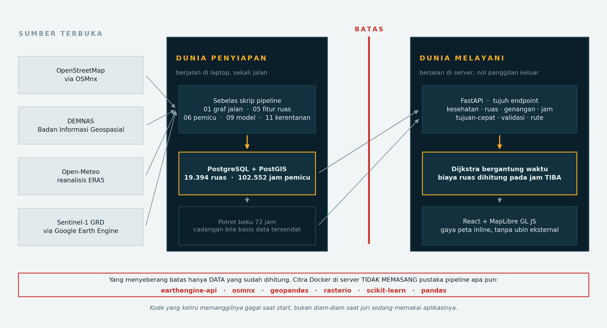
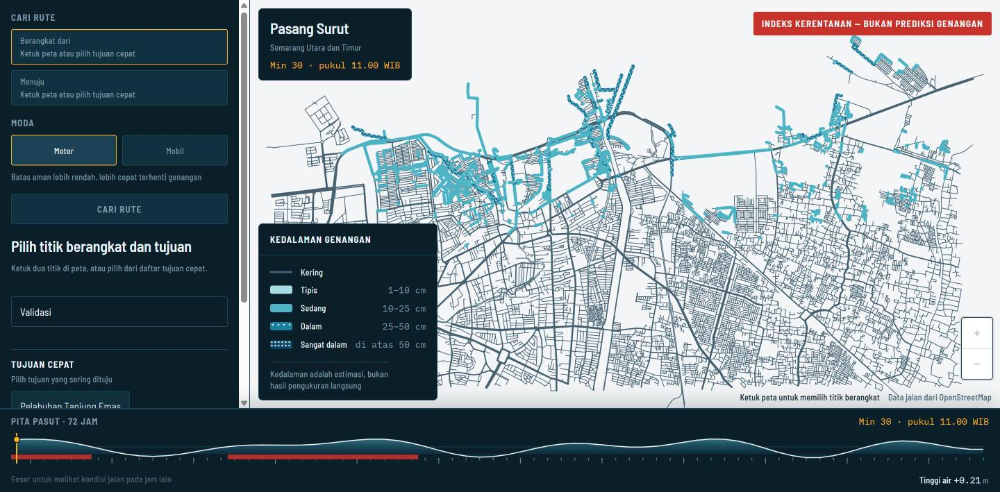
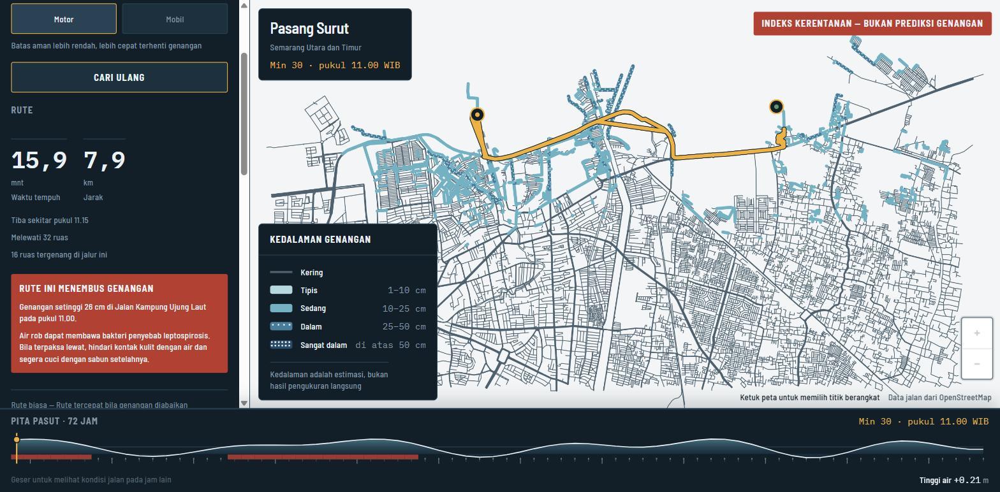
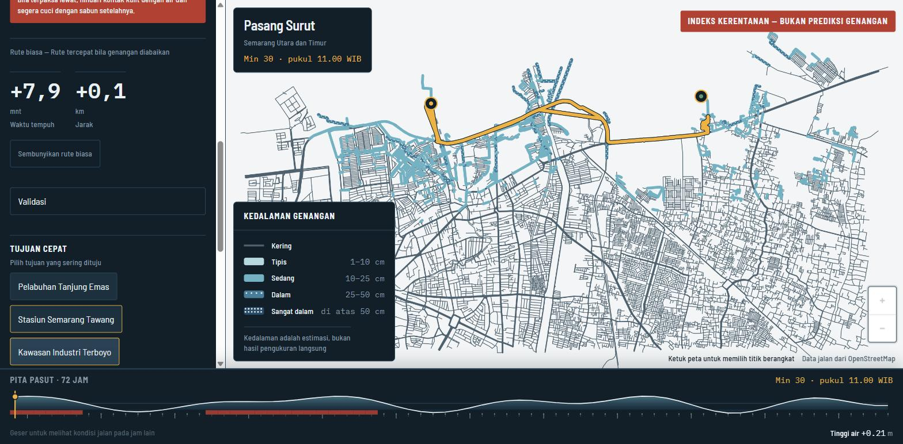
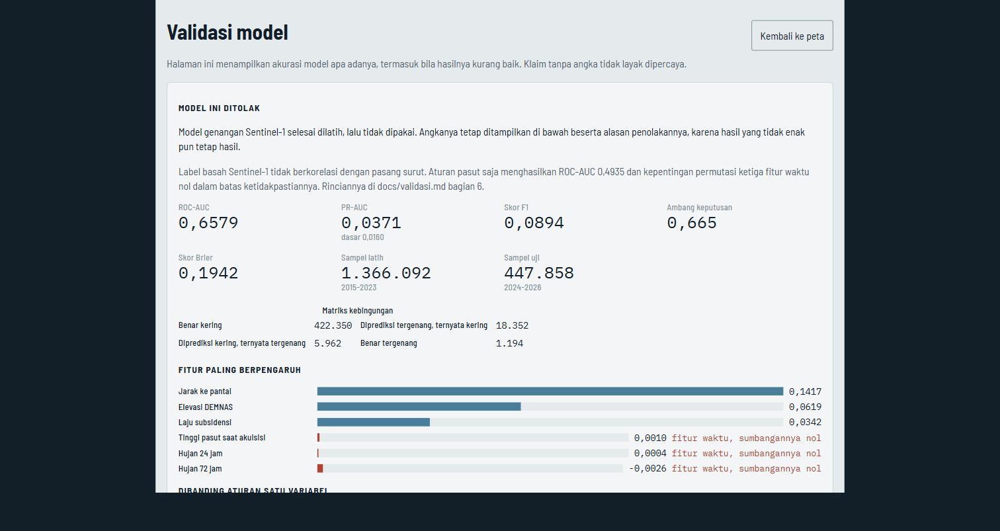
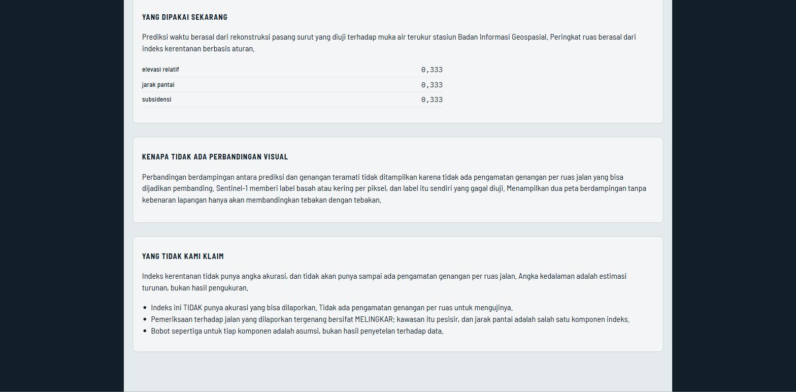
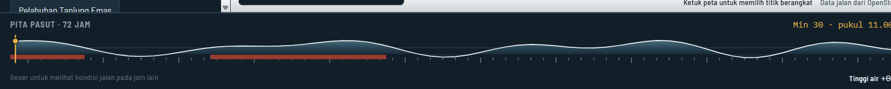
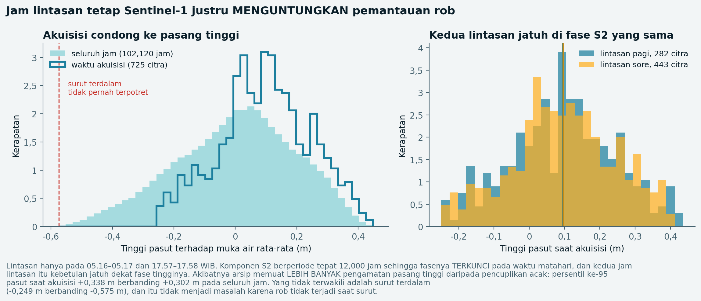
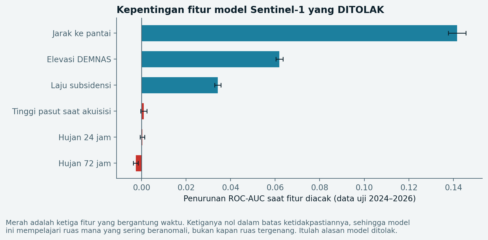

# Draft proposal — PASANG SURUT

> **Status berkas ini.** Draft Markdown untuk M7. Pemformatan Word dikerjakan
> manusia di M8.
>
> **BERKAS INI ADALAH SUMBER KEBENARAN.** Diputuskan 29 Agustus 2026.
> `.docx` di akar repo dibangun ulang dari berkas ini pada M8, dan bukan
> sebaliknya. Setiap perubahan isi proposal disunting di sini lebih dulu.
>
> Alasannya: Markdown bisa di-diff di git sehingga perubahan antar sesi
> terlihat, sedangkan `.docx` tidak.
>
> **Setiap angka di bawah punya sitasi, atau ditandai `TODO(sumber)`.**
> Tidak ada angka yang dikarang. Ringkasan seluruh `TODO(sumber)` ada di
> akhir berkas.

---

## 1. Judul Karya

**PASANG SURUT**

*Sistem Perutean Sadar Banjir Rob Berbasis Rekonstruksi Pasang Surut
Terkalibrasi untuk Mobilitas Rendah Karbon di Kota Semarang*

| Atribut | Keterangan |
|---|---|
| Tim | trio la albiceleste |
| Institusi | Institut Teknologi Sepuluh Nopember (ITS), Surabaya |
| Tema ANFORCOM 2026 | Circular Economy for Eco-Health Cities |
| Tema DSDC | Engineering the Circular City: Software Solutions for a Sustainable and Healthy Urban Future |
| Subtema | 4 — Smart Low-Carbon Urban Mobility |
| SDG yang disasar | SDG 3 Good Health and Well-Being; SDG 11 Sustainable Cities and Communities |
| Anggota | Muhammad Dzaky Ahnaf (5027231039), Daffa Rajendra Priyatama (5027231009), Naufal Syafi' Hakim (5027231022) |

**Catatan atas perubahan subjudul.** Subjudul semula "Berbasis Kalibrasi
Citra Radar Sentinel-1". Kalibrasi itu dikerjakan — 725 citra, 1,81 juta nilai
backscatter — lalu ditolak tim sendiri (Bagian 9). Sistem yang dikumpulkan
tidak lagi berdiri di atasnya, maka subjudulnya diubah: menyisakan klaim yang
tidak lagi benar adalah overclaim.

---

## 2. Abstrak

Kota Semarang mengalami penurunan muka tanah terukur hingga 9,4 sentimeter
per tahun, dengan rata-rata 5,8 sentimeter per tahun di Kecamatan Genuk yang
menaungi Terboyo dan Kaligawe [1]. Akibatnya banjir rob berulang menggenangi
jalur utama kota, termasuk akses Pelabuhan Tanjung Emas dan kawasan industri.
Riset World Resources Institute Indonesia yang dipublikasikan April 2026
memperkirakan sekitar 10 persen jaringan jalan Semarang, setara 11 persen
aktivitas mobilitas warga, berpotensi terdampak rob, dengan total kerugian
akibat gangguan transportasi sekitar Rp848 miliar per tahun [2].

PASANG SURUT memprediksi **kapan** setiap ruas jalan berisiko tergenang untuk
72 jam ke depan pada resolusi per jam. Komponen waktunya berasal dari
rekonstruksi harmonik pasang surut yang tervalidasi terhadap muka air terukur
stasiun pasut Badan Informasi Geospasial, dengan korelasi 0,78 hingga 0,91 dan
RMSE 0,10 hingga 0,12 meter [3][4]; komponen ruangnya dari indeks kerentanan
per ruas yang disusun dari elevasi relatif, jarak ke pantai, dan laju
penurunan muka tanah. Keduanya menjadi bobot dinamis pada graf jaringan jalan,
sehingga perutean menghindari ruas berisiko pada jam keberangkatan, bukan yang
tergenang saat ini.

Model genangan berbasis 725 citra radar Sentinel-1 sepanjang 2015 hingga 2026
sudah dilatih, namun **ditolak oleh tim sendiri** karena label basahnya
terbukti tidak berkorelasi dengan pasang surut; angka dan alasannya dilaporkan
terbuka pada Bagian 9. Elevasi tidak pernah dipakai sebagai ambang genangan,
karena galat vertikal model elevasi nasional mencapai 2,79 meter [5], jauh
melampaui tinggi rob 10 hingga 50 sentimeter.

Sistem juga menghitung biaya adaptasi tiap perjalanan — selisih waktu, jarak,
bahan bakar, dan emisi CO2e terhadap rute yang mengabaikan genangan, disajikan
sebagai rentang — serta menerbitkan peringatan paparan kesehatan bila rute
terpaksa menembus genangan.

**Kata kunci:** banjir rob, penurunan muka tanah, perutean bergantung waktu,
Sentinel-1, adaptasi iklim perkotaan, mobilitas rendah karbon

---

## 3. Latar Belakang Masalah

### 3.1 Kota yang turun sementara lautnya naik

Semarang menghadapi dua tekanan yang saling memperkuat. Dari bawah, muka tanah
turun akibat pengambilan air tanah dan pembebanan kawasan terbangun. Penelitian
SBAS atas 13 citra Sentinel-1A periode 2015–2018 mencatat laju rata-rata 5,8
sentimeter per tahun di Genuk dan 4,6 di Semarang Utara, dengan nilai tertinggi
9,4 sentimeter per tahun, pada ketidakpastian ±1,3 sentimeter per tahun [1].

Dari atas, muka air laut naik. Rekaman stasiun pasut IOC `sema` menunjukkan
kenaikan muka air **relatif** sekitar 9 sentimeter per tahun sepanjang
2015–2025 [4] — bukan kenaikan muka laut absolut, melainkan campuran kenaikan
laut, penurunan tanah tempat alat berdiri, dan kemungkinan perubahan datum.

Karena elevasi pesisirnya hampir setara permukaan laut, kombinasi keduanya
membuat rob berulang bukan kejadian luar biasa melainkan kondisi harian yang
dapat diperkirakan.

### 3.2 Kerugian mobilitas yang jarang dihitung

Diskusi publik tentang rob umumnya berhenti pada rumah tergenang dan tanggul
yang belum selesai. Yang jarang dihitung adalah kerugian mobilitas. Riset WRI
Indonesia April 2026 mengisi kekosongan itu: sekitar 10 persen jaringan jalan
Semarang dan 11 persen aktivitas mobilitas berpotensi terdampak, dengan
kerugian gangguan transportasi sekitar Rp848 miliar per tahun [2].

### 3.3 Celah yang dinyatakan lembaga riset itu sendiri

Riset yang sama menyimpulkan penanganan yang bertumpu pada infrastruktur fisik
belum cukup, dan menyerukan pergeseran ke perencanaan transportasi yang lebih
adaptif [2]. Tanggul tidak akan selesai sebelum besok pagi, sementara warga
tetap harus berangkat kerja.

### 3.4 Dampak berlapis pada kesehatan

Kasus leptospirosis di Kota Semarang tercatat naik dari 32 pada 2024 menjadi
59 pada 2025 [9]. Penularannya lewat
kontak kulit dengan air terkontaminasi urin tikus, dan genangan rob di jalan
adalah medium yang tepat untuk itu.

### 3.5 Rumusan masalah

1. Bagaimana memperkirakan **kapan** ruas jalan tertentu berisiko tergenang
   rob, bukan sekadar apakah ia rawan?
2. Bagaimana memasukkan perkiraan itu ke keputusan perjalanan harian tanpa
   menuntut warga memahami pasang surut?
3. Bagaimana menyatakan biaya menghindari genangan secara terukur, sehingga
   dapat dibandingkan dan dievaluasi?

---

## 4. Tujuan dan Manfaat Dikembangkannya Perangkat Lunak

### 4.1 Tujuan

1. Memprediksi kapan tiap ruas jalan di wilayah pilot berisiko tergenang untuk
   72 jam ke depan pada resolusi per jam.
2. Merutekan perjalanan dengan bobot yang bergantung waktu, sehingga biaya
   ruas dihitung pada waktu **tiba** di ruas itu.
3. Menyatakan biaya adaptasi tiap perjalanan sebagai rentang terukur.
4. Menerbitkan peringatan paparan kesehatan dan menyarankan jam berangkat
   alternatif ketika genangan tidak dapat dihindari.
5. Melaporkan seluruh batasan dan angka validasi apa adanya, termasuk yang
   tidak menguntungkan.

### 4.2 Manfaat bagi warga

Warga mengetahui jam berapa jalur yang biasa dilalui berisiko, dan berapa
lama tambahan waktu bila memutar. Peringatan paparan memberi informasi
kesehatan yang selama ini tidak menyertai keputusan perjalanan.

### 4.3 Manfaat bagi pelaku usaha dan logistik

Truk menuju Pelabuhan Tanjung Emas dan kawasan industri Terboyo dapat menggeser
jam keberangkatan berdasarkan prediksi, bukan laporan lisan.

### 4.4 Manfaat bagi pemerintah kota

Indeks kerentanan per ruas dan rekonstruksi pasut menyediakan dasar kuantitatif
untuk memprioritaskan penanganan. Seluruh metode dan datanya terbuka.

### 4.5 Letaknya terhadap tema ANFORCOM 2026

Rulebook membolehkan karya bersandar pada **salah satu atau keduanya** dari
Circular Economy dan Eco-Health. Karya ini bersandar pada **Eco-Health**, dan
kami menyebutkannya terang-terangan daripada memaksakan kaitan circular
economy yang tidak ada.

**Eco-Health, menjawab SDG 3.** Genangan rob bukan hanya penghalang lalu
lintas melainkan medium penularan: kasus leptospirosis Kota Semarang naik dari
32 pada 2024 menjadi 59 pada 2025 [9]. Sistem ini menghubungkan kesehatan
lingkungan dengan kesehatan manusia pada titik keputusan yang paling
menentukan — saat orang memilih lewat mana dan jam berapa — lewat peringatan
paparan yang terbit ketika rute terpaksa menembus air di atas ambang moda.

**Kota sehat dan berkelanjutan, menjawab SDG 11.** Adaptasi harian tidak
menunggu tanggul selesai; warga tetap harus berangkat kerja besok pagi.

**Mobilitas rendah karbon, subtema 4.** Tiap rute disertai selisih waktu,
jarak, bahan bakar, dan emisi CO2e terhadap rute yang mengabaikan genangan.
Menghindari genangan berarti memutar, dan memutar berarti bahan bakar — biaya
itu **dihitung dan ditampilkan**, bukan disembunyikan.

**Konteks lokal, bukan solusi generik.** Sistem dibangun dari konstanta pasut
stasiun Semarang, DEMNAS, subsidensi per kecamatan, dan graf jalan wilayah
pilot. Ia **tidak dapat dipindah** ke kota lain tanpa mengulang kalibrasinya.

---

## 5. Batasan Perangkat Lunak yang Dikembangkan

Batasan yang kami tulis sendiri lebih baik daripada yang ditemukan juri.
Daftar ini lengkap.

### 5.1 Batasan metodologis

1. **Yang digunakan indeks kerentanan berbasis aturan yang diskalakan pasang
   surut**, bukan model hidrodinamik maupun model statistik dari genangan
   teramati. Sistem **tidak mengklaim akurasi prediksi genangan**, karena tidak
   ada pengamatan genangan per ruas untuk mengujinya.

2. **Kedalaman genangan adalah estimasi turunan.** Citra radar Sentinel-1 hanya
   memberikan label permukaan basah atau kering. Angka sentimeter lahir dari
   fungsi monotonik yang dibatasi 10 sampai 50 sentimeter; batas itu sendiri
   asumsi, bukan hasil pengukuran tim.

3. **Bobot indeks sepertiga tiap komponen adalah asumsi.** Menyetelnya tanpa
   data uji hanya menyembunyikan tebakan di balik desimal.

4. **DEMNAS bergalat vertikal RMSE 2,79 meter** [5] sedangkan rob yang
   dimodelkan 10 sampai 50 sentimeter. Karena itu elevasi dipakai **relatif**
   terhadap ruas tetangga dalam radius 500 meter; simpangan bakunya turun dari
   5,86 menjadi 2,99 meter.

5. **Keterbatasan tiap masukan.** Laju penurunan muka tanah berdaya pisah per
   kecamatan, bukan per ruas, dan periodenya 2015–2018 [1] — memakainya untuk
   2026 adalah ekstrapolasi delapan tahun, dengan ketidakpastian ±1,3 cm/tahun
   yang setara 36 persen bagi kecamatan berlaju 3,6. Curah hujan berasal dari
   reanalisis satu titik untuk AOI seluas 13 × 8 km, sehingga hujan konvektif
   setempat tidak tertangkap. Konstanta pasut berasal dari rekaman 15 hari [3];
   dua dari tujuh komponen (P1 dan K2) diturunkan dari K1 dan S2 memakai rasio
   baku Admiralty, dan koreksi nodal 18,6 tahun belum diterapkan.

6. **Faktor emisi dan konsumsi kini bersitasi, dengan satu pengecualian.**
   Faktor emisi diturunkan dengan cara baku IPCC [10]; keduanya faktor bahan
   bakar murni, sehingga emisi solar cenderung DILEBIHKAN untuk Indonesia yang
   memakai biodiesel. Konsumsi motor 50 km/liter cocok dengan angka pabrikan
   skuter [11], dan konsumsi mobil 11,1 km/liter berada di dalam rentang yang
   dilaporkan untuk mobil penumpang di Indonesia [14]. Keduanya rentang
   industri, **bukan rata-rata nasional resmi** — tidak ada yang diterbitkan.
   Angka truk 4 km/liter tetap tanpa sitasi, tetapi truk **tidak dapat dipilih
   pengguna** di antarmuka dan karenanya tidak pernah masuk angka yang
   ditampilkan.

7. **Penalti perutean adalah angka rancangan, bukan pengukuran.** Biaya ruas
   dikalikan 1,0 saat kering, 2,5 di atas ambang lambat, 8,0 di atas ambang
   berisiko; di atas ambang tak-bisa-lewat ruas dibuang dari graf. Keempat
   angka itu ditetapkan tim berdasarkan pertimbangan, bukan hasil pengamatan
   lapangan tentang seberapa lambat kendaraan sesungguhnya melintasi genangan
   setinggi tertentu. Penalti inilah yang menentukan selisih antar-rute, dan
   selisih itulah seluruh isi Bagian 11. Ambangnya sendiri dibaca dari tabel
   konfigurasi moda, bukan ditulis tetap di dalam kode, sehingga dapat
   dikoreksi tanpa menyentuh program begitu ada pengukuran.

8. **Sebagian besar kejadian rob pemvalidasi belum terverifikasi.** Uji silang
   Bagian 9.4 memakai 16 kejadian; hanya dua berstatus verifikasi primer,
   sisanya bertanggal dari pemberitaan. Liputan 2015–2019 juga tipis. Median
   persentil 80,2 berdiri di atas bukti yang lebih lemah daripada kesan
   angkanya.

### 5.2 Batasan cakupan

- Wilayah kerja dibatasi pilot Semarang Utara dan Semarang Timur — Tanjungmas,
  Bandarharjo, Kemijen, Kaligawe, Terboyo Kulon, Terboyo Wetan. Bukan seluruh
  Kota Semarang.
- Moda yang didukung sepeda motor dan mobil; angkutan umum dan pejalan kaki
  belum dimodelkan.
- Horizon prediksi 72 jam.
- Sistem tidak menerima laporan genangan dari warga secara waktu nyata.
- **Sistem ini bukan peringatan dini resmi.** Untuk keputusan evakuasi, rujukan
  yang berlaku adalah BPBD.

### 5.3 Batasan operasional

- Prediksi dihitung sebelumnya secara luring, sehingga sistem tahan gangguan
  jaringan tetapi tidak memutakhirkan diri sendiri.
- Waktu tempuh dari kecepatan bebas hambatan yang dikoreksi genangan;
  kemacetan biasa tidak diperhitungkan, dan kecepatan ruas tanpa tag
  `maxspeed` berasal dari imputasi OSMnx.
- Jaringan jalan adalah potret OpenStreetMap 24 Agustus 2026; dari 19.394
  ruas, 6.518 tanpa nama jalan.

---

## 6. Metodologi Pengembangan

### 6.1 Pendekatan

Pengembangan dijalankan sebagai tujuh milestone harian dengan pembekuan fitur
pada milestone kelima. Setiap milestone ditutup dengan memperbarui catatan
progres, catatan validasi, dan daftar batasan — sehingga temuan yang tidak
menguntungkan tercatat pada saat ditemukan, bukan disaring di akhir. Ketiga
catatan itu ikut dalam repositori yang ditautkan pada Lampiran A.

### 6.2 Mengapa bukan model bathtub berbasis ambang elevasi

Pendekatan yang lazim adalah model *bathtub*: menandai setiap sel yang
elevasinya di bawah tinggi muka air sebagai tergenang. Untuk kasus ini
pendekatan itu **tidak sah**, dan alasannya aritmetis. DEMNAS bergalat vertikal
RMSE 2,79 meter [5] sementara rob yang dimodelkan 10 sampai 50 sentimeter —
alat ukurnya lima sampai dua puluh delapan kali lebih kasar daripada besaran
yang diukur. Terlihat pula dari data wilayah pilot sendiri: selisih antara
persentil ke-25 dan median elevasi di dalam AOI hanya 2,44 meter, masih di
bawah ketidakpastian alat ukurnya.

Karena itu elevasi dipakai secara **relatif** terhadap ruas tetangga dalam
radius 500 meter. Galat DEM sebagian besar berkorelasi spasial: bila satu petak
terangkat, tetangganya ikut terangkat kira-kira sama, sehingga pengurangan
terhadap nilai tengah tetangga meniadakan sebagian besarnya. Terukur,
simpangan bakunya turun dari 5,86 menjadi 2,99 meter. Yang tersisa adalah beda
tinggi setempat antar ruas — dan itulah yang menentukan ke mana air mengalir.

### 6.3 Mengapa kalibrasi Sentinel-1 dikerjakan, dan mengapa akhirnya ditolak

Rencana semula adalah mengganti ambang elevasi dengan **kebenaran lapangan
dari citra radar**: mengambil seluruh citra Sentinel-1 di atas AOI sejak 2015,
mencatat tinggi pasut dan curah hujan pada tiap akuisisi, lalu melatih model
untuk mempelajari sendiri hubungan antara pemicu dan genangan teramati.

Rencana itu dijalankan tuntas lewat Google Earth Engine [8]: 725 citra, 2.502
ruas berstrata, 1.813.950 nilai backscatter. Hasilnya ditolak; angka, sebab,
dan lima upaya penyelamatannya ada di Bagian 9.

Satu keberatan sempat diperiksa dan **terbantah**: meski Sentinel-1 sinkron
matahari, arsipnya justru memuat lebih banyak pasang tinggi daripada
pencuplikan acak — persentil ke-95 +0,338 berbanding +0,302 meter. Yang tidak
terwakili justru surut terdalam, dan rob tidak terjadi saat surut. Akibat kedua
dari sinkronisitas yang sama dibahas di Bagian 9.3.

### 6.4 Pembagian data dan pencegahan kebocoran

Pemisahan latih dan uji dilakukan **berdasarkan waktu**, tidak pernah acak:
latih 2015–2023, uji 2024–2026. Pemisahan acak akan menempatkan ruas dari
citra yang sama di kedua sisi, dan akurasi yang dihasilkan akan palsu.

---

## 7. Analisis Kebutuhan dan Desain Solusi Perangkat Lunak

### 7.1 Pengguna sasaran

| Pengguna | Kebutuhan utama |
|---|---|
| Warga pesisir Semarang Utara dan Timur | tahu jam berapa jalur biasanya berisiko |
| Pengemudi logistik menuju Tanjung Emas dan Terboyo | menggeser jam berangkat berdasarkan prediksi |
| Perencana kota dan BPBD | dasar kuantitatif untuk prioritas penanganan |

### 7.2 Kebutuhan fungsional

1. Menampilkan peta jaringan jalan dengan kedalaman genangan per jam.
2. Penggeser waktu 72 jam yang menampilkan kurva pasang surut (Pita Pasut).
3. Perutean dua jalur sekaligus: sadar rob dan pembanding yang mengabaikannya.
4. Panel dampak: selisih waktu, jarak, bahan bakar, emisi — sebagai rentang.
5. Peringatan paparan kesehatan bila rute tetap menembus genangan.
6. Saran jam berangkat alternatif yang dapat ditekan.
7. Tombol tujuan cepat untuk empat titik penting.
8. Halaman validasi yang menampilkan metrik apa adanya.
9. Lencana peringatan sumber data yang tidak punya saklar manual.

### 7.3 Kebutuhan non-fungsional

1. **Nol panggilan jaringan keluar saat melayani.** Ditegakkan tiga lapis:
   lapisan API tidak mengimpor pustaka jaringan, gaya peta ditulis inline
   tanpa ubin eksternal, dan citra Docker tidak memasang pustaka pipeline.
2. **Tetap melayani tanpa database.** Diuji: tujuh dari tujuh endpoint hidup
   dengan koneksi database sengaja dirusak, dan perutean tetap menghitung
   sungguhan dari potret beku.
3. Seluruh teks antarmuka berasal dari satu berkas; helper `t()` melempar
   galat bila kunci atau placeholder tidak ditemukan.
4. Kedalaman tidak pernah disampaikan lewat warna saja — dua kelas terdalam
   ditumpuk pola titik agar terbaca dalam cetakan hitam putih.
5. Sasaran sentuh minimal 44 × 44 piksel; kontras teks minimal 4,5:1.
6. **Tata letak ponsel diuji pada lebar 390 piksel**, bukan hanya dirancang.
   Pada lebar itu rail kiri berubah menjadi lembar bawah dan peta mengisi
   bagian atas layar. Pengujian menemukan satu cacat — spanduk peringatan
   dan pelat judul saling menimpa — yang kemudian diperbaiki dengan menyusun
   keduanya bertingkat.

### 7.4 Alur pengguna

Buka aplikasi → tekan dua tujuan cepat → rute muncul → geser Pita Pasut ke jam
pasut tinggi → ruas terisi → baca panel dampak → bila peringatan paparan
muncul, tekan saran jam alternatif → Pita Pasut melompat ke jam itu.

---

## 8. Arsitektur Sistem dan Spesifikasi Tools/Teknologi

### 8.1 Arsitektur

Sistem dipisah tegas menjadi dua dunia. **Dunia penyiapan** berjalan di laptop
dan menyentuh OpenStreetMap, DEMNAS, Open-Meteo, dan Earth Engine. **Dunia
melayani** berjalan di server dan tidak menyentuh satu pun di antaranya.

Pemisahan itu ditegakkan, bukan sekadar disepakati: citra Docker yang di-deploy
**tidak memasang** `earthengine-api`, `osmnx`, `geopandas`, `rasterio`,
`scikit-learn`, maupun `pandas`. Kode yang keliru memanggilnya gagal saat
start, bukan diam-diam saat juri memakainya.

**Gambar 9 — Arsitektur sistem.** Empat sumber terbuka di kiri masuk ke dunia
penyiapan yang berjalan di laptop; hasilnya mengendap di basis data dan satu
potret beku. Dunia melayani di kanan hanya membaca keduanya. Garis merah
menandai batas yang tidak dilewati kode pipeline, dan pita di bawah menyebut
pustaka mana saja yang sengaja tidak dipasang di server.

### 8.2 Spesifikasi teknologi

| Lapisan | Pilihan | Alasan |
|---|---|---|
| API | FastAPI + Uvicorn | dokumentasi OpenAPI otomatis, tipe terperiksa |
| Basis data | PostgreSQL + PostGIS (Supabase) | kueri spasial tanpa ORM |
| Perutean | Dijkstra bergantung waktu, ditulis sendiri | biaya dihitung pada waktu tiba |
| Frontend | React + Vite + MapLibre GL JS | bebas token, gaya dapat ditulis inline |
| Gaya | CSS custom property | tiap warna dari satu berkas, nol heks di komponen |
| Model | HistGradientBoostingClassifier | dilatih lalu ditolak, Bagian 9 |
| Kontainer | Docker, 244 MB | hanya lima paket runtime |

### 8.3 Sumber data

Seluruh sumber terbuka. Jaringan jalan OpenStreetMap via OSMnx (ODbL);
elevasi DEMNAS [5]; garis pantai OSM `natural=coastline`; laju penurunan muka
tanah Rahmawati dkk [1]; konstanta pasut Rachman dkk [3]; muka air terukur
stasiun IOC `sema` [4]; curah hujan Open-Meteo ERA5 [6]; label genangan
Sentinel-1 GRD IW VV via Earth Engine [7]; faktor emisi IPCC 2006 dikali nilai
kalor [10]; konsumsi BBM motor angka pabrikan [11]; baseline dampak WRI
Indonesia [2]. **Konsumsi BBM mobil dan truk tetap asumsi rancangan.**

---

## 9. Implementasi Perangkat Lunak

### 9.1 Status modul

| Modul | Status | Progres |
|---|---|---|
| Pembangunan graf jalan dari OpenStreetMap | Selesai | 19.394 ruas, 1.289,4 km |
| Skema basis data dan lapisan repositori | Selesai | 5 tabel, 4 repositori |
| Rekonstruksi harmonik pasang surut | Selesai | acuan fase WIB, terkalibrasi |
| Fitur ruas dan variabel pemicu | Selesai | 19.394 ruas, 102.552 jam |
| Ekstraksi label genangan Sentinel-1 | Selesai | 725 citra, 1,81 juta nilai |
| Pelatihan dan validasi model genangan | Selesai, **ditolak** | lihat 9.2 dan 9.3 |
| Indeks kerentanan | Selesai | 19.394 ruas |
| Mesin perutean bergantung waktu | Selesai | 13 uji lolos |
| Modul akuntansi dampak | Selesai | rentang, bukan angka tunggal |
| REST API | Selesai | 7 endpoint, 35 uji lapisan HTTP lolos |
| Antarmuka PWA dan peta | Selesai | manifest dan service worker |
| Halaman validasi | Selesai | metrik apa adanya |
| Potret tahan banting | Selesai | 7/7 endpoint hidup tanpa basis data |
| Penerapan ke Render dan Vercel | Selesai | daring, lihat Lampiran A |

### 9.2 Hasil validasi model — apa adanya

Pemisahan berdasarkan waktu: latih 2015–2023 (1.366.092 baris, 546 citra),
uji 2024–2026 (447.858 baris, 179 citra).

| Metrik | Nilai |
|---|---|
| ROC-AUC | 0,6579 |
| PR-AUC | 0,0371 (proporsi dasar 0,0160) |
| Skor F1 | 0,0894 pada ambang 0,665 |
| Skor Brier | 0,1942 |
| Matriks konfusi | TN 422.350 · FP 18.352 · FN 5.962 · TP 1.194 |

**Model ini ditolak.** Kepentingan permutasi pada data uji menunjukkan
sebabnya:

| Fitur | Penurunan ROC-AUC |
|---|---|
| Jarak ke pantai | +0,1417 ± 0,0039 |
| Elevasi DEMNAS | +0,0619 ± 0,0016 |
| Laju subsidensi | +0,0342 ± 0,0014 |
| **Tinggi pasut saat akuisisi** | **+0,0010 ± 0,0014** |
| **Hujan 24 jam** | **+0,0004 ± 0,0010** |
| **Hujan 72 jam** | **−0,0026 ± 0,0011** |

Ketiga fitur bergantung waktu nol dalam batas ketidakpastiannya: model ini
mempelajari ruas mana yang sering beranomali, bukan **kapan** ruas tergenang.
Aturan "pasut saja" menghasilkan ROC-AUC 0,4935 — setara lemparan koin.

### 9.3 Lima upaya penyelamatan, seluruhnya gagal

| Upaya | Hasil |
|---|---|
| Cuplikan areal radius 100 m | ROC-AUC 0,5982 pada ambang setara — lebih buruk |
| Kriteria dua arah (pantulan ganda di kawasan terbangun) | arah benar, besarnya hanya 0,47 simpangan baku pada 12 citra |
| Luas air kawasan terbuka | korelasi terhadap pasut **negatif** |
| Muka air **terukur**, bukan astronomis | mentah −0,29, ternyata **semu** |
| Topeng air permanen, lalu label per ruas | mentah **+0,362**, tersisa **+0,107** |

Dua upaya terakhir sempat tampak berhasil, dan keduanya runtuh saat diperiksa.

Upaya keempat memberi −0,29, sepuluh kali lebih kuat, tetapi semu: rekaman
stasiun melayang naik 0,92 meter dalam sepuluh tahun, dan setelah layangan
diluruskan sisanya +0,05.

Upaya kelima bertahan paling lama. Setelah tubuh air tetap ditopengkan, luas
DARATAN yang tampak berair berkorelasi **+0,362** terhadap pasut pada orbit 76
— arah yang benar secara fisika. Dua keberatan lalu diuji. **Pertama**, yang
diukur luas kawasan sedangkan sistem merutekan per ruas; label per ruas dari
487.890 cuplikan atas 2.502 ruas menurunkannya ke **+0,230**. **Kedua**,
Sentinel-1 sinkron matahari sehingga komponen K1 dan P1 bergeser fase
berperiode setahun dan dapat rancu dengan musim hujan; setelah hari-dalam-tahun
diregresikan, sisanya **+0,107** — musim ternyata menjelaskan 38,6 persen ragam
pasut pada waktu akuisisi. Bukti bebas berupa tanggal kejadian rob bahkan
**berlawanan arah** (−0,77 simpangan baku).

Korelasi +0,11 dengan bukti kejadian yang berlawanan bukan dasar untuk
melabeli 19.394 ruas.

### 9.4 Yang tervalidasi: rekonstruksi pasang surut

Acuan waktu fase konstanta tidak dinyatakan sumbernya, sehingga seluruh offset
−12 sampai +12 jam disisir terhadap muka air terukur stasiun IOC `sema` [4]:

| Jendela uji | Fase = UTC | Fase = WIB |
|---|---|---|
| 2 hari | −0,289 | **+0,907** |
| 4 hari | −0,362 | **+0,909** |
| 7 hari | −0,427 | **+0,858** |
| 10 hari | −0,465 | **+0,782** |

Memakai UTC bukan sekadar kurang tepat melainkan **berkebalikan**. RMSE pada
acuan WIB 0,097–0,116 meter terhadap rentang terukur 0,920 meter. Diuji silang
terhadap 16 kejadian rob terdokumentasi, median persentil tinggi pasut pada
hari kejadian 80,2 — dari 50 yang diharapkan bila tidak berhubungan.

## 10. Mockup dan Tangkapan Layar Aplikasi

Seluruh gambar berikut diambil dari aplikasi yang berjalan.

**Gambar 1 — Peta genangan dan Pita Pasut.** Ruas diwarnai menurut tangga
kedalaman; dua kelas terdalam ditumpuk pola titik agar urutannya tetap terbaca
dalam cetakan hitam putih dan oleh pengguna buta warna. Bilah di dasar layar
adalah **Pita Pasut**, penggeser waktu 72 jam berisi kurva pasang surut dan
palang penanda jam tergenang. Spanduk merah menyatakan yang ditampilkan adalah
indeks kerentanan, bukan prediksi genangan.

**Gambar 2 — Rute dan peringatan paparan.** Rute sadar rob digambar ambar di
atas peta biru, mengikuti konvensi navigasi laut. Panel kiri memuat waktu
tempuh, jarak, jumlah ruas dilewati, dan jumlah ruas tergenang. Peringatan
paparan terbit karena rute menembus genangan di atas ambang moda, lengkap
dengan kedalaman, nama ruas, dan jamnya.

**Gambar 3 — Selisih terhadap rute yang mengabaikan genangan.** Biaya adaptasi
dinyatakan sebagai selisih terhadap rute pembanding, bukan sebagai klaim
penghematan.

**Gambar 4 dan 5 — Halaman validasi.** Metrik model Sentinel-1 ditampilkan apa
adanya di dalam aplikasi, termasuk ROC-AUC 0,6579 dan matriks kebingungannya,
dengan tiga fitur bergantung waktu ditandai "sumbangannya nol". Gambar kelima
memuat pernyataan aplikasi sendiri tentang apa yang **tidak** diklaim.

**Gambar 6 — Pita Pasut, rinci.** Garis ukurnya meniru papan duga air
pelabuhan; palang merah menandai jam tergenang, pegangan ambar menunjukkan jam
yang sedang dilihat.

**Gambar 7 — Sebaran tinggi pasut saat akuisisi Sentinel-1.** Membantah
kekhawatiran bahwa arsip citra tidak memuat pasang tinggi: persentil ke-95
justru lebih tinggi daripada pencuplikan acak.

**Gambar 8 — Kepentingan permutasi fitur model yang ditolak.** Dasar visual
bagi keputusan penolakan pada Bagian 9.2: ketiga fitur yang bergantung waktu
nol dalam batas ketidakpastiannya.

---

## 11. Impact Projection

Proyeksi disusun sebagai rantai estimasi eksplisit: tiap tautan menyatakan
sumbernya, tiap asumsi dinyatakan sebagai asumsi.

### 11.1 Baseline

Kerugian gangguan transportasi akibat rob di Kota Semarang sekitar **Rp848
miliar per tahun**, dengan sekitar 10 persen jaringan jalan dan 11 persen
aktivitas mobilitas terdampak [2]. Baseline ini dipilih karena berasal dari
lembaga riset independen, bersatuan rupiah per tahun sehingga langsung dapat
dijadikan penyebut, dan terbit pada tahun berjalan.

### 11.2 Rantai estimasi

| Tautan | Nilai | Dasar |
|---|---|---|
| Baseline kerugian transportasi | Rp848 miliar/tahun | WRI Indonesia 2026 [2] |
| Panjang jaringan jalan wilayah pilot | 1.289,4 km | diukur dari graf OSM |
| Panjang jaringan jalan Kota Semarang | 839,90 km | BPS dan DPU Kota Semarang, 2025 [13] |
| Bagian jaringan di wilayah pilot | **tidak dapat dihitung** | dasar ukurnya berbeda, lihat di bawah |
| Ruas terdampak pada pasut puncak | 1.028 dari 19.394 (5,3%) | keluaran sistem |
| Perjalanan yang rutenya berubah | 44% dari 150 pasangan uji | keluaran sistem |
| **Selisih waktu per perjalanan** | **median 0,12 mnt · p75 1,67 mnt** | keluaran sistem |
| **Selisih jarak per perjalanan** | **median 0,00 km · p75 0,14 km** | keluaran sistem |
| **Hemat menggeser jam berangkat** | **median 0,14 mnt · p90 2,99 mnt · maks 6,83 mnt** | keluaran sistem |
| Perjalanan terdampak per hari | belum diperoleh | tidak dipakai menghitung |
| Tingkat adopsi | asumsi, belum ditetapkan | bukan pengukuran |
| Proyeksi nilai terselamatkan | **tidak dihitung** | lihat 11.5 |

**Mengapa bagian jaringan tidak dapat dihitung.** Angka 839,90 km mencakup
**hanya jalan berkewenangan pemerintah kota** — BPS menyatakannya sendiri —
sedangkan graf kami 1.289,4 km mencakup seluruh ruas yang dapat dilalui,
termasuk gang. Membaginya menghasilkan angka di atas 100 persen. Keduanya
mengukur hal berbeda, dan kami memilih tidak memaksakan rasio daripada
menerbitkan persentase yang salah.

**Cara angka sistem diperoleh.** 150 pasangan asal-tujuan acak berjarak
minimal 2 km, dirutekan pada jam pasut tertinggi di dalam jendela prediksi
(keadaan terburuk, bukan rata-rata harian), moda sepeda motor. Dilaporkan
median dan kuartil, bukan rata-rata, karena sebarannya sangat menceng:
sebagian besar perjalanan tidak terpengaruh sama sekali.

### 11.3 Dampak lingkungan

Pada perjalanan persentil ke-75, selisih bahan bakar 0,002–0,004 liter dan
emisi 0,004–0,008 kg CO₂e; pada perjalanan median keduanya di bawah 0,001.
Faktor emisi mengikuti cara baku IPCC [10], konsumsi motor bersitasi angka
pabrikan [11], sedangkan konsumsi mobil dan truk serta rentang ±30 persen
masih asumsi.

### 11.4 Dampak kesehatan

Sistem menerbitkan peringatan paparan bila rute tetap menembus genangan di
atas ambang berisiko moda. **Batas klaim:** tim **tidak** mengklaim sistem ini
menurunkan angka kasus leptospirosis — hubungan itu dipengaruhi banyak faktor
di luar kendali perangkat lunak.

### 11.5 Keterbatasan proyeksi — dan mengapa nilai rupiah tidak dihitung

Ini bagian terpenting dari Bagian 11, dan kami memilih menuliskannya alih-alih
menghasilkan angka besar.

**Penghematan per perjalanan yang terukur sangat kecil.** Median 0,12 menit
untuk perutean dan 0,14 menit untuk pergeseran jam. Bahkan pada persentil
ke-90, penghematan pergeseran jam hanya 2,99 menit.

Sebabnya dapat dijelaskan: jaringan jalan Semarang cukup rapat sehingga memutar
mengelilingi ruas tergenang biasanya pendek, dan pada jendela yang diuji tidak
ada ruas yang melampaui ambang tak-bisa-lewat sehingga tidak ada ruas yang
benar-benar dibuang dari graf.

Mengalikan angka sekecil itu dengan jumlah perjalanan yang belum bersumber dan
tingkat adopsi yang kami tetapkan sendiri akan menghasilkan angka rupiah besar
yang seluruh besarnya berasal dari dua bilangan karangan. **Kami memilih tidak
melakukannya.**

Tiga keterbatasan lain:

1. Genangan yang mendasarinya berasal dari indeks kerentanan, bukan model
   tervalidasi. Seluruh angka di bagian ini mewarisi batasan itu.
2. Baseline WRI mencakup seluruh Kota Semarang sedangkan sistem mencakup
   wilayah pilot; alokasi proporsional adalah penyederhanaan.
3. Nilai sesungguhnya sistem ini kemungkinan besar **bukan** pada menit yang
   dihemat, melainkan pada kerusakan kendaraan dan paparan kesehatan yang
   dihindari — dan keduanya tidak kami ukur.

---

## 12. Penutup

PASANG SURUT memprediksi kapan tiap ruas berisiko tergenang rob untuk 72 jam
ke depan, lalu merutekan menghindarinya pada jam keberangkatan. Komponen
waktunya tervalidasi terhadap data terukur; komponen ruangnya indeks berbasis
aturan yang tidak kami klaim punya akurasi.

Bagian yang paling ingin kami tekankan bukan yang berhasil. Model berbasis 725
citra Sentinel-1 dibangun tuntas, diuji, **lima kali** diupayakan diselamatkan,
lalu ditolak — dan angkanya kami laporkan seluruhnya, termasuk di dalam
aplikasinya sendiri. Hasil negatif yang terdokumentasi lebih berharga daripada
angka akurasi yang tidak dapat dipertanggungjawabkan.

---

## 13. Daftar Pustaka

[1] Rahmawati, A. N. T., Prasetyo, Y., dan Sasmito, B. "Studi Penurunan Muka
Tanah dengan Metode Small Baseline Area Subset (SBAS) Menggunakan Citra
Sentinel-1A: Studi Kasus Kota Semarang." *Jurnal Geodesi Undip*, 9(1), 29–36,
2020. ISSN 2337-845X.

[2] Ma'arif, A. (Sustainable Mobility Analyst, WRI Indonesia). Paparan studi
kasus banjir rob Semarang, diskusi WRI Indonesia 8 April 2026, dilaporkan
Suara.com 9 April 2026, suara.com/news/2026/04/09/165500 (30 Agustus 2026).
Riset primernya belum terbit.

[3] Rachman, R. K., Ismunarti, D. H., dan Handoyo, G. "Pengaruh Pasang Surut
Terhadap Sebaran Genangan Banjir Rob di Kecamatan Semarang Utara." *Jurnal
Oseanografi*, Universitas Diponegoro, 4(1), 1–9, 2015.

[4] IOC Sea Level Monitoring. Stasiun `sema`, Semarang. Badan Informasi
Geospasial dan GeoForschungsZentrum. ioc-sealevelmonitoring.org (29 Agustus
2026).

[5] Badan Informasi Geospasial. "DEMNAS: Model Elevasi Digital Nasional."
tanahair.indonesia.go.id/portal-web/unduh/demnas (28 Agustus 2026).

[6] Open-Meteo. "Historical Weather API (ERA5 reanalysis)." open-meteo.com
(28 Agustus 2026).

[7] European Space Agency. "Sentinel-1 mission and data products."
sentiwiki.copernicus.eu/web/s1-mission (28 Agustus 2026).

[8] Google Earth Engine. "Sentinel-1 SAR GRD collection."
developers.google.com/earth-engine/datasets/catalog/COPERNICUS_S1_GRD
(28 Agustus 2026).

[9] Hakam, A. (Kepala Dinas Kesehatan Kota Semarang), dikutip Beritajateng.id,
Tribun Jateng, dan JPNN Jateng: 32 kasus leptospirosis pada 2024, 59 kasus dan
8 kematian pada 2025 (30 Agustus 2026).

[10] IPCC, *2006 Guidelines for National Greenhouse Gas Inventories*, Vol. 2
Tabel 1.4 (bensin 69.300, solar 74.100 kg CO2/TJ) dikali nilai kalor acuan KLHK
(solar 36 x 10^-6 TJ/liter): solar 2,67 dan bensin 2,31 kg CO2/liter.

[11] Konsumsi motor 0,020 liter/km setara 50 km/liter, di dalam rentang angka
pabrikan skuter Indonesia — Honda BeAT 55–60 km/liter (Kompas Otomotif, 30
Agustus 2026).

[13] Badan Pusat Statistik Kota Semarang, "Panjang Jalan Menurut Jenis
Permukaan Jalan di Kota Semarang (Kilometer), 2025", bersumber Dinas Pekerjaan
Umum Kota Semarang, diperbarui 17 Maret 2026. semarangkota.bps.go.id (30
Agustus 2026).

[14] Konsumsi mobil penumpang di Indonesia dilaporkan 8–12 km/liter (Premium),
12–16 (Pertalite), 16–20 (Pertamax) — Auto2000 dan Wuling Indonesia (30
Agustus 2026).

[12] Himpunan Mahasiswa Informatika Universitas Diponegoro. *Rulebook
Diponegoro Software Development Competition ANFORCOM 2026*. Semarang, 2026.

---

## 14. Lampiran

Seluruh butir lampiran mengikuti ketentuan rulebook kompetisi [12].

### Lampiran A — Tautan wajib

| Bukti | Tautan |
|---|---|
| Video demo YouTube | (diisi saat pengumpulan) |
| Repositori GitHub | https://github.com/dzakyahnaf/pasang-surut |
| Prototipe Figma | (diisi saat pengumpulan) |
| Aplikasi live | https://pasang-surut.vercel.app |
| API | https://pasang-surut-api.onrender.com |

### Lampiran B — Peta jalan pengembangan

1. Ground truth genangan per ruas dari BPBD atau laporan warga — prasyarat
   bagi perbandingan prediksi versus genangan teramati, yang tidak kami
   tampilkan **karena bahannya tidak ada**.
2. Cakupan seluruh Kota Semarang; moda angkutan umum dan pejalan kaki.
3. Koreksi nodal 18,6 tahun, prakiraan gelombang badai, model hidrodinamik,
   dan integrasi lalu lintas waktu nyata.

### Lampiran C — Pembagian peran tim

| Anggota | Peran |
|---|---|
| Muhammad Dzaky Ahnaf | Ketua tim; rekayasa data dan pemodelan |
| Daffa Rajendra Priyatama | Pengembangan antarmuka dan visualisasi peta |
| Naufal Syafi' Hakim | Analisis dampak, dokumentasi, dan pengujian |

---

## Jumlah halaman — DIUKUR, bukan diperkirakan

`.docx` dibangun ulang dari berkas ini oleh `backend/scripts/22_bangun_docx.py`,
lalu dibuka dengan Microsoft Word dan dibaca statistiknya:

| Yang diperiksa | Hasil | Ketentuan rulebook |
|---|---|---|
| Jumlah halaman | **24** | maksimal 30, termasuk sampul dan lampiran |
| Ukuran kertas | 21 × 29,7 cm | A4 |
| Margin | kiri 4, kanan 3, atas 3, bawah 3 cm | 4-3-3-3 |
| Huruf | Times New Roman 12 pt | Times New Roman 12 |
| Spasi baris | 1,5 | 1,5 |
| Gambar tertanam | 9 | — |
| Tabel | 11 | — |

### Kenapa perkiraan lama meleset tujuh halaman

Kepadatan 156 kata/halaman diturunkan dari `.docx` lama, yang memuat **14
page break manual** — tiap bagian dimulai di halaman baru, dan bagian yang
berakhir di tengah halaman menyisakan sisanya kosong. Taksiran itu sebetulnya
mengukur ruang putih, bukan isi. Dokumen sekarang hanya punya satu page break,
yaitu setelah sampul.

### Page break per bagian sudah dicoba, dan ditolak

Skrip pembangun punya opsi `--pecah-per-bagian`. Dijalankan dan diukur:
**31 halaman, melewati batas 30.** Biayanya tujuh halaman, persis sebesar
ruang putih yang dulu membuat perkiraan meleset. Karena itu opsinya ada
tetapi tidak dipakai.

### Sisa enam halaman

Bila ingin menambah isi, yang paling menambah nilai adalah **tangkapan layar
aplikasi pada lebar ponsel**. Tata letaknya sudah diuji pada 390 piksel dan
satu cacat sudah diperbaiki, tetapi gambarnya harus diambil dari perangkat
sungguhan: merender peta di dalam iframe sempit membuat MapLibre gagal
menggambar, dan tangkapan layar berpeta kosong akan membuat aplikasi tampak
rusak — lebih buruk daripada tidak ada gambar sama sekali.

## Proposal ini harus berdiri sendiri

Diputuskan 30 Agustus: **juri dianggap HANYA membaca proposal**, tidak membuka
repositori. Konsekuensinya sudah diterapkan dan wajib dijaga:

- **Tidak ada penanda `TODO` di Bagian 1–14.** Angka tanpa sumber ditulis
  sebagai kalimat jujur ("belum diperoleh", "tetap tanpa sitasi"), bukan
  notasi pengembang yang membuat dokumen tampak belum selesai.
- **Tidak ada rujukan ke berkas repositori** sebagai tempat isi. Sebelumnya
  Bagian 5 menulis "diringkas dari `docs/batasan.md`", Bagian 9 menunjuk
  `docs/validasi.md`, dan pustaka menunjuk `docs/sumber_angka.md` — ketiganya
  membuat proposal terbaca sebagai ringkasan dokumen lain.
- **Tidak ada kode milestone internal** seperti M5 atau M8.
- **Bagian 10 berisi keterangan gambar**, bukan daftar berkas yang harus
  disisipkan penulis.

Bila memangkas, pangkas berurutan dari yang paling aman:

| Bagian | Kata | Halaman | Cara memangkas |
|---|---:|---:|---|
| 9. Implementasi | 664 | 4.3 | ringkas narasi upaya keempat dan kelima di 9.3 |
| 5. Batasan | 521 | 3.3 | gabungkan butir 3 dan 5 |
| 11. Impact Projection | 585 | 3.8 | ringkas 11.2, **jangan sentuh 11.5** |
| 10. Mockup | 250 | 1.6 | gabungkan keterangan Gambar 3 ke Gambar 2 |

**JANGAN pangkas Bagian 4.5.** Kriteria "Kesesuaian dengan Tema/Subtema"
berbobot 15 persen dan menuntut karya mencerminkan tema besar ANFORCOM **dan**
subtema DSDC. Sebelum 30 Agustus proposal ini tidak menyebut tema besar sama
sekali.

**Yang tidak boleh dipangkas.**

Bagian **11.5** — penjelasan mengapa nilai rupiah tidak dihitung. Itulah yang
membedakan proposal ini dari yang mengalikan dua bilangan tak bersumber
menjadi angka besar.

Bagian **9.2 dan 9.4** — angka model yang ditolak beserta angka rekonstruksi
pasut yang tervalidasi. Keduanya bukti bahwa klaim pada Abstrak dapat
dipertanggungjawabkan.

Bagian **6.2** — alasan aritmetis menolak model bathtub. Ini pembeda
metodologis yang paling mungkin ditanyakan juri Geodesi.

---

## Ringkasan TODO(sumber) — wajib diselesaikan sebelum pengumpulan

Delapan angka atau rujukan belum bersumber. Diurutkan menurut seberapa besar
akibatnya bila dipertanyakan juri.

| # | Yang belum bersumber | Muncul di | Akibat bila ditanya |
|---|---|---|---|
| 1 | **Tautan riset WRI April 2026** — Rp848 miliar, 10 persen jaringan, 11 persen mobilitas | Abstrak, 3.2, 11.1, Pustaka [2] | **Terparah.** Ini baseline seluruh Bagian 11 dan angka pembuka Abstrak. Tanpa tautan, satu-satunya angka besar di proposal tidak bisa diverifikasi |
| 2 | **Faktor konsumsi bahan bakar per km** — motor 0,020 · mobil 0,090 · truk 0,250 L/km | 5.1 butir 8, 8.3, 11.3, Pustaka [10] | Angka ini **tampil di antarmuka** lewat panel dampak, jadi juri melihatnya langsung saat mencoba aplikasi |
| 3 | **Faktor emisi** — bensin 2,31 · solar 2,68 kg CO₂/L | idem | Sama seperti nomor 2. Nilai baku yang lazim dipakai, tetapi lazim bukan sitasi |
| 4 | **Kasus leptospirosis** — 32 kasus 2024, 59 kasus 2025 | 3.4, Pustaka [9] | Dipakai membangun argumen kesehatan. Bagian 11.4 sudah membatasi klaimnya, tetapi angkanya tetap perlu sumber |
| 5 | **Panjang jaringan jalan Kota Semarang** | 11.2 | Memutus rantai estimasi pada tautan ketiga; tanpa ini bagian jaringan pilot tidak bisa dihitung |
| 6 | **Jumlah perjalanan terdampak per hari** | 11.2 | Memutus rantai pada tautan berikutnya |
| 7 | **Normal curah hujan BMKG stasiun Semarang** | 5.1 butir 6 | Ringan. Hanya untuk membandingkan rerata ERA5 1.830 mm; ketiadaannya sudah dinyatakan sebagai batasan |
| 8 | **Tingkat adopsi** | 11.2 | **Bukan TODO(sumber)** melainkan asumsi. Harus tetap ditulis sebagai asumsi, jangan dicarikan sumber |

**Nomor 5 dan 6 boleh tetap kosong.** Bagian 11.5 sudah menjelaskan mengapa
nilai rupiah tidak dihitung, dan alasan itu berdiri sendiri tanpa keduanya.
Mengisinya dengan tebakan justru merusak argumen bagian tersebut.

**Nomor 1 sampai 4 wajib diisi.** Keempatnya angka yang sudah tercetak di
proposal dan di aplikasi.

### TODO non-sumber

| Yang belum ada | Muncul di |
|---|---|
| Tautan aplikasi live dan API | 9.5, Lampiran A |
| Tautan video YouTube | 9.5, Lampiran A |
| Tautan prototipe Figma | 9.5, Lampiran A |
| Enam tangkapan layar aplikasi | Bagian 10 |
| Konfirmasi pembagian peran tim | Lampiran C |
